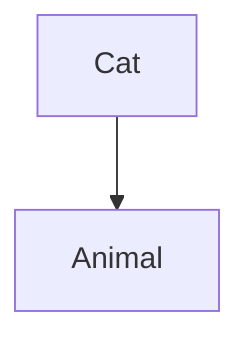
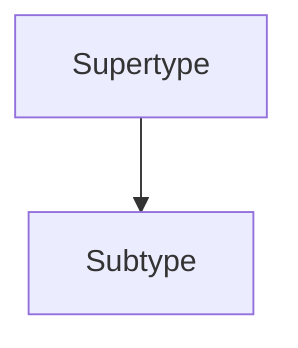
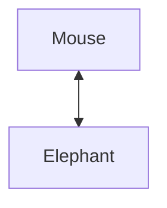
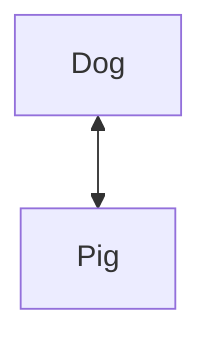
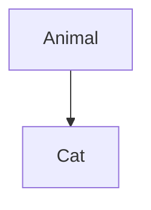
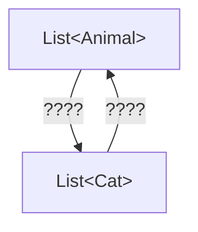
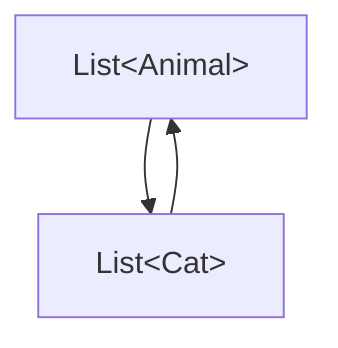
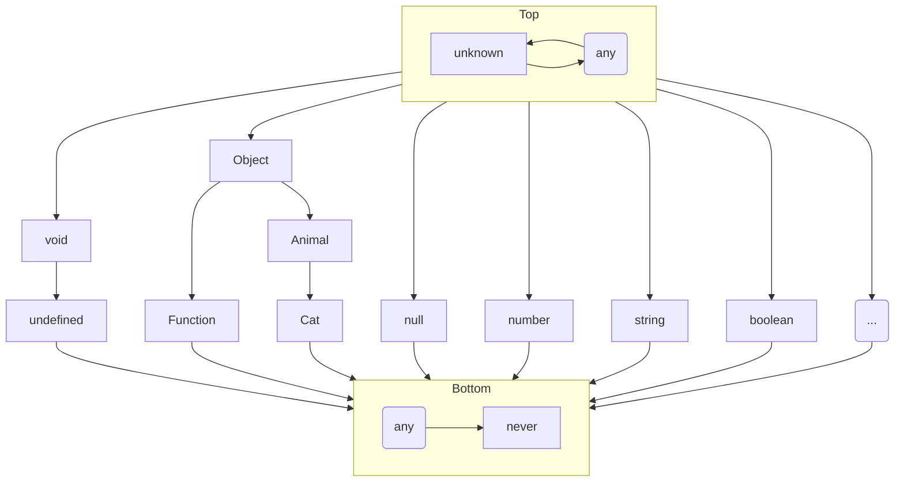

# Will you be my covariant

#######

# Will you be my covariant

1. Refresher
2. Pop Quiz
3. Purpose
4. What is variance?
5. What makes something covariant
6. What makes something contravariant
7. What makes something Invariant
8. Another Quiz
9. Demo

#######

# Refresher

-------

## What is inheritance: example



-------

## What is inheritance: more generically



-------

## Test



-------

## Test



-------

## What is inheritance

```typescript
interface Animal {
  live: boolean
};

interface Cat extends Animal {
  meow: void
};

declare const cat: Cat;
cat.live // ok
cat.meow // ok

// subtype polymorphism
const animal: Animal = cat;
animal === cat // true
animal.live // ok
animal.meow // meow does not exist on animal
```

-------

if this is ok <!-- .element: class="fragment" data-fragment-index="1" -->

<span class="fragment" data-fragment-index="2">

```typescript
declare const cat: Cat;

const animal: Animal = cat; // ok
```

</span>

is this ok? <!-- .element: class="fragment" data-fragment-index="3" -->

<span class="fragment" data-fragment-index="4">

```typescript
declare const cats: Array<Cat>;

const animals: Array<Animal> = cats; // maybe
```

</span>

#######

# Pop Quiz

-------

## Can we do this?

```typescript
const cats: Cat[] = [];
const dogs: Dog[] = [];
const animals: Animal[] = cats;

declare const dog: Dog;
animals.push(dog);

cats[0].meow;
```

Is this legal? <!-- .element: class="fragment" data-fragment-index="2" -->

Yes! <!-- .element: class="fragment" data-fragment-index="3" -->

But it should be. <!-- .element: class="fragment" data-fragment-index="4" -->

That's why variance is important <!-- .element: class="fragment" data-fragment-index="5" -->

#######

# Purpose

-------

## Purpose

Understand when variance applies <!-- .element: class="fragment" data-fragment-index="1" -->

Understand how it is helpful <!-- .element: class="fragment" data-fragment-index="2" -->

Understand how to profit from it <!-- .element: class="fragment" data-fragment-index="3" -->

#######

# What is variance?

Variance refers to the subtyping relationship between complex types and the subtyping relationship of their components. <!-- .element: class="fragment" data-fragment-index="1" -->

-------

# What is variance?

<div class="layout-row">





</div>

-------

# Covariance

<div class="layout-row">




</div>

#######

# SVG

```svg
  const s = Snap(800, 600);
  const bigCircle = s.circle(150, 150, 100);
  bigCircle.attr({
    fill: '#bada55',
    stroke: '#000',
    strokeWidth: 5,
  });
```

#######

# Auto-animate

-------

# Auto-animate <!-- .element: style="margin-top: 100px; color: red;" -->

#######

# Slide 1



```javascript
let a = 1;
let b = 2;
let c = x => 1 + 2 + x;
```

---

## Slide 2

- Item 1 <!-- .element: class="fragment" data-fragment-index="2" -->
- Item 2 <!-- .element: class="fragment" data-fragment-index="1" -->

---

## Slide 3
<!-- .slide: data-background="#ff0000" -->

-------

## Slide 4

```js [1-2|3|4]
let a = 1;
let b = 2;
let c = x => 1 + 2 + x;
c(3);
```

-------

# Slide 5

| Tables        | Are           | Cool  |
| ------------- |:-------------:| -----:|
| col 3 is      | right-aligned | $1600 |
| col 2 is      | centered      |   $12 |
| zebra stripes | are neat      |    $1 |
